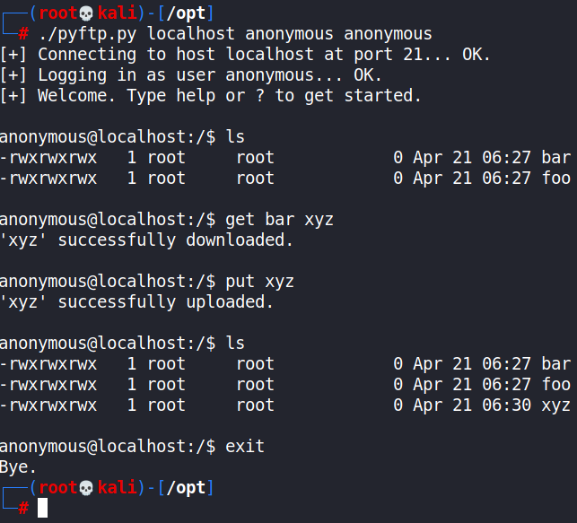

# PyFTP
A simple Python 2 implementation of an FTP client that uses some functions of the ftplib module.

# Motivation
During the post-exploitation phase of a penetration test, PyFTP can be useful for scenarios where there is no ftp client installed on the target machine, but there is Python installed.

# How to use PyFTP
Run the script with `python2 pyftp.py [--port PORT] <host> <user> <password>`. An example on how to use it can be seen in the image below. For more detailed info, run `python2 pyftp.py -h`.

# Additional comments
* It is also possible to run this script on Python 3. However, some modifications to the code are required.
* The upload, download and removal of files with space characters and/or special characters are currently not supported. However, the creation, removal and change of directories with space characters are supported.
* If you're running this script inside a Metasploit shell, type "?" instead of "help", if needed.
* Please file an issue if this script doesn't behave as expected.
